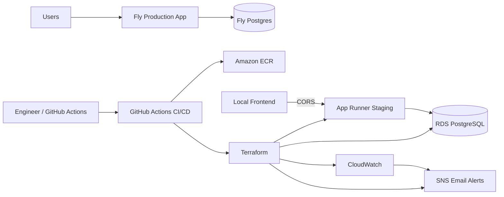
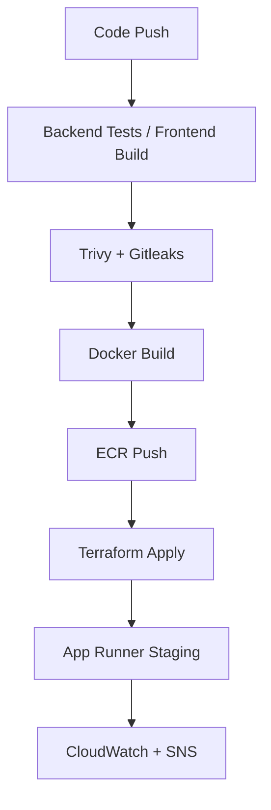

# Construction Dashboard Monorepo

This repository hosts the backend API (`backend/`) and the React SPA (`frontend/`). During development you usually run both projects separately, while production deployments serve the compiled frontend straight from the backend app (single Fly.io service).

## Local development

1. Start Postgres + run Prisma migrations (`cd backend && npx prisma migrate dev`).
2. Launch the API: `cd backend && npm install && npm run dev`.
3. In another terminal run the UI: `cd frontend && npm install && VITE_API_BASE=http://localhost:4000 npm run dev`.

## Environment variables

Templates are provided so secrets do not get committed:

- `backend/.env.example`
- `frontend/.env.example`

Copy them to `.env` locally and fill in real values. Do not commit `.env` files.

## Backend integration tests

The backend test suite uses `Vitest` + `Supertest` and targets a separate PostgreSQL database.
This keeps API tests isolated from development data.

Run tests locally:

```bash
cd backend
npm test
```

Environment variables used by tests:

- `DATABASE_URL_TEST` - connection string for the test database
- `TEST_DB_MIGRATE` - when `true` (default), applies migrations before tests
- `TEST_DB_TEARDOWN` - when `true`, truncates test tables after tests (enabled in CI)

Test run flow:

1. `backend/tests/global.setup.ts` loads `.env.test` and runs `prisma migrate deploy`.
2. `Vitest` executes the API integration tests.
3. `backend/tests/global.teardown.ts` clears test data while keeping Prisma migration history.

A GitHub Actions workflow is included at `.github/workflows/backend-api-tests.yml` and
starts a temporary PostgreSQL service for CI runs.

## QA Strategy

The QA approach is risk-based and centered on the business areas most likely to cause operational or financial regressions:

- authentication and role-based access
- receipts, invoices, payments, inventory, and payroll
- master data management for customers, suppliers, and job sites
- reporting and export flows

Quality gates currently include:

- DB-backed backend integration tests
- Playwright E2E smoke coverage
- accessibility smoke checks on key pages
- backend performance smoke on an authenticated reporting endpoint
- frontend production build validation
- security scans
- staging deployment validation for infrastructure changes

QA strategy: `docs/test-strategy.md`
Regression checklist: `docs/regression-checklist.md`
Release signoff template: `docs/release-signoff-template.md`

## Architecture Diagram



## AWS CI/CD and IaC

The repository includes AWS deployment automation:

- Terraform stack in `infrastructure/terraform/`
- Multi-environment tfvars under `infrastructure/terraform/environments/`
- Deployment workflow at `.github/workflows/deploy-aws.yml`
- Security workflow at `.github/workflows/security-checks.yml` (Trivy + Gitleaks)
- Frontend E2E workflow at `.github/workflows/frontend-e2e.yml`
- Backend performance workflow at `.github/workflows/backend-performance-smoke.yml`

Default deployment behavior:

- Push to `main` deploys to `staging`
- Manual dispatch can deploy to `prod` (configure GitHub Environment approvals)

Setup checklist: `docs/devops-setup.md`
AWS bootstrap guide: `docs/aws-bootstrap.md`
Rollback runbook: `docs/rollback-runbook.md`
Fly migration runbook: `docs/fly-to-aws-db-migration.md`
Observability guide: `docs/observability.md`
Ephemeral staging guide: `docs/ephemeral-staging.md`
Architecture decision: `docs/architecture-decision.md`
Cost and platform tradeoffs: `docs/cost-and-platform-tradeoffs.md`

## Platform Decision

- Fly is the current production platform serving active users.
- AWS is a migration-ready staging environment and a future production path if the application needs to scale further or require stronger operational controls.
- Production is not being moved to AWS yet because Fly is already working well and the AWS architecture has a higher fixed monthly cost.

## Deployment Flow



## Ephemeral Staging Commands

Bring staging up from the repo root:

```bash
terraform -chdir=/Users/bassam/construction-dashboard/infrastructure/terraform init -reconfigure -backend-config=backends/staging.hcl

terraform -chdir=/Users/bassam/construction-dashboard/infrastructure/terraform apply \
  -var-file=environments/staging.tfvars \
  -var="ecr_image_identifier=385502454961.dkr.ecr.us-east-1.amazonaws.com/constructiondashboard:sha-2acfeb38ae28"
```

Tear staging down from the repo root:

```bash
terraform -chdir=/Users/bassam/construction-dashboard/infrastructure/terraform destroy \
  -var-file=environments/staging.tfvars \
  -var="ecr_image_identifier=385502454961.dkr.ecr.us-east-1.amazonaws.com/constructiondashboard:sha-2acfeb38ae28"
```
