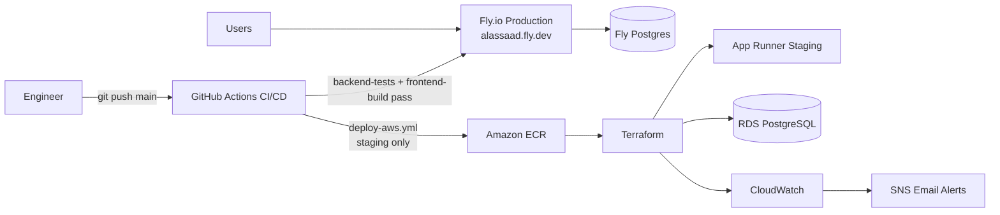
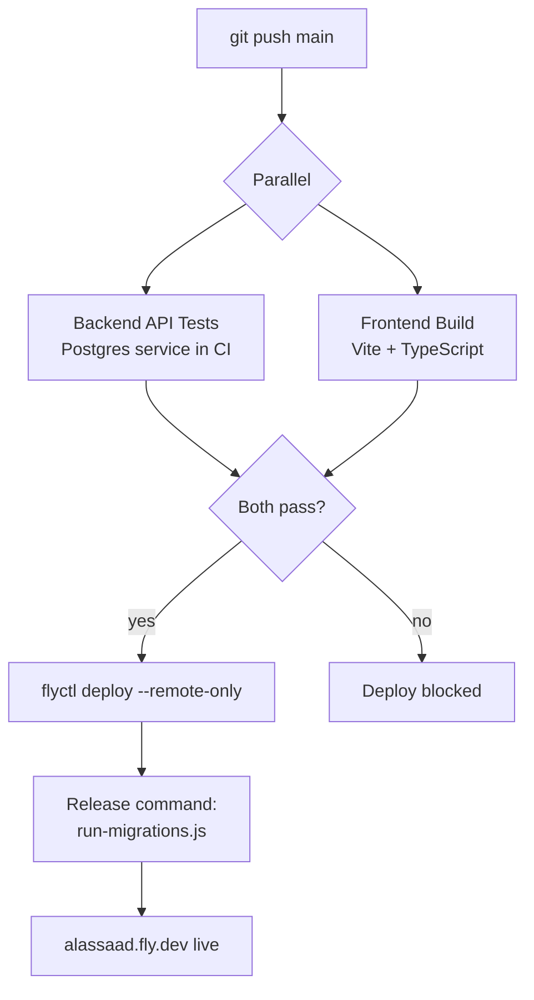
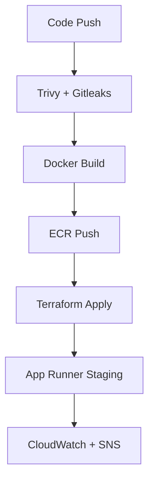

# Construction Dashboard Monorepo

This repository hosts the backend API (`backend/`) and the React SPA (`frontend/`). During development you usually run both projects separately, while production deployments serve the compiled frontend straight from the backend app (single Fly.io service).

## Local development

1. Start Postgres + run Prisma migrations (`cd backend && npx prisma migrate dev`).
2. Launch the API: `cd backend && npm install && npm run dev`.
3. In another terminal run the UI: `cd frontend && npm install && VITE_API_BASE=http://localhost:4000 npm run dev`.

## Environment variables

Templates are provided so secrets do not get committed:

- `backend/.env.example`
- `frontend/.env.example`

Copy them to `.env` locally and fill in real values. Do not commit `.env` files.

## Backend integration tests

The backend test suite uses `Vitest` + `Supertest` and targets a separate PostgreSQL database.
This keeps API tests isolated from development data. The suite covers authentication, RBAC,
receipts, invoices, payments, payroll, and cash-flow logic — 55 tests total (43 integration,
12 unit).

Run tests locally:

```bash
cd backend
npm test
```

Environment variables used by tests:

- `DATABASE_URL_TEST` - connection string for the test database
- `TEST_DB_MIGRATE` - when `true` (default), applies migrations before tests
- `TEST_DB_TEARDOWN` - when `true`, truncates test tables after tests (enabled in CI)

Test run flow:

1. `backend/tests/global.setup.ts` loads `.env.test` and runs `prisma migrate deploy`.
2. `Vitest` executes the API integration tests.
3. `backend/tests/global.teardown.ts` clears test data while keeping Prisma migration history.

## QA Strategy

The QA approach is risk-based and centered on the business areas most likely to cause operational or financial regressions:

- authentication and role-based access
- receipts, invoices, payments, inventory, and payroll
- master data management for customers, suppliers, and job sites
- reporting and export flows

Quality gates currently include:

- DB-backed backend integration tests
- risk-based Playwright E2E tiers (`@smoke`, `@critical`, `@nightly`)
- accessibility checks on key pages
- nightly backend performance smoke on an authenticated reporting endpoint
- JMeter-based load testing assets for deeper performance validation
- frontend production build validation
- security scans
- staging deployment validation for infrastructure changes

Execution model:

- PRs / pushes to `main`: backend API tests + frontend build (parallel) → deploy to Fly.io production if both pass; Playwright `@smoke` + `@critical`, security checks
- nightly: full Playwright regression and backend performance smoke

QA strategy: `docs/test-strategy.md`
Regression checklist: `docs/regression-checklist.md`
Release signoff template: `docs/release-signoff-template.md`
Performance testing: `docs/performance-testing.md`

## Architecture Diagram



## CI/CD Workflows

**Production (Fly.io)** — `.github/workflows/deploy-fly.yml`

- Triggers on push to `main` (touching `backend/`, `frontend/`, `fly.toml`, or the workflow itself) and on manual dispatch
- Runs backend API tests (against a temporary Postgres service) and a frontend production build in parallel
- Deploys to `alassaad.fly.dev` only after both pass (`flyctl deploy --remote-only`)
- Requires `FLY_API_TOKEN` secret in the `production` GitHub environment

**AWS Staging (disabled by default to save cost)** — `.github/workflows/deploy-aws.yml`

- Enable manually when you need to validate against the AWS App Runner staging environment
- Terraform stack in `infrastructure/terraform/`; multi-environment tfvars in `infrastructure/terraform/environments/`

**Other workflows:**

- Security: `.github/workflows/security-checks.yml` (Trivy + Gitleaks)
- Frontend E2E: `.github/workflows/frontend-e2e.yml`
- Nightly regression: `.github/workflows/frontend-e2e-nightly.yml`
- Backend performance smoke: `.github/workflows/backend-performance-smoke.yml`

Setup checklist: `docs/devops-setup.md`
AWS bootstrap guide: `docs/aws-bootstrap.md`
Rollback runbook: `docs/rollback-runbook.md`
Fly migration runbook: `docs/fly-to-aws-db-migration.md`
Observability guide: `docs/observability.md`
Ephemeral staging guide: `docs/ephemeral-staging.md`
Architecture decision: `docs/architecture-decision.md`
Cost and platform tradeoffs: `docs/cost-and-platform-tradeoffs.md`

## Platform Decision

- Fly is the current production platform serving active users.
- AWS is a migration-ready staging environment and a future production path if the application needs to scale further or require stronger operational controls.
- Production is not being moved to AWS yet because Fly is already working well and the AWS architecture has a higher fixed monthly cost.

## Deployment Flow

**Production (Fly.io):**



**AWS Staging (manual, disabled by default):**



## Ephemeral Staging Commands

Bring staging up from the repo root (replace `<SHA>` with the ECR image tag to deploy):

```bash
terraform -chdir=infrastructure/terraform init -reconfigure -backend-config=backends/staging.hcl

terraform -chdir=infrastructure/terraform apply \
  -var-file=environments/staging.tfvars \
  -var="ecr_image_identifier=385502454961.dkr.ecr.us-east-1.amazonaws.com/constructiondashboard:<SHA>"
```

Tear staging down from the repo root:

```bash
terraform -chdir=infrastructure/terraform destroy \
  -var-file=environments/staging.tfvars \
  -var="ecr_image_identifier=385502454961.dkr.ecr.us-east-1.amazonaws.com/constructiondashboard:<SHA>"
```
