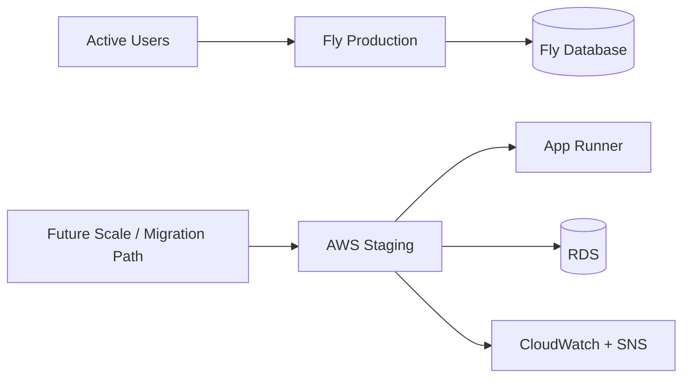

# Architecture Decision

## Decision

Keep Fly as the current production platform.
Use AWS as a migration-ready staging environment and an alternative production path for future scaling.

## Context

The application is already in active use on Fly.
The project now also has an AWS deployment path with:

- GitHub Actions CI/CD
- Terraform-managed infrastructure
- App Runner
- RDS
- CloudWatch alarms and dashboard
- SNS email alerting

## Platform Diagram

## Why production remains on Fly

- it is already serving real users
- it is operationally simpler for the current stage of the product
- it avoids introducing migration risk without a business-driven reason
- it is likely cheaper than keeping the full AWS stack running continuously

## Why AWS is still valuable

- it demonstrates production-style DevOps practices
- it provides a realistic cloud staging environment
- it prepares an AWS-native path if the application needs to scale to more users or stronger operational controls
- it can be created and destroyed on demand to control cost

## Consequences

- Fly remains the production source of truth for the live application
- AWS staging is treated as a temporary, migration-ready environment
- data migration from Fly to AWS is not a current priority
- future platform migration should happen only if justified by cost, reliability, scale, or compliance needs
